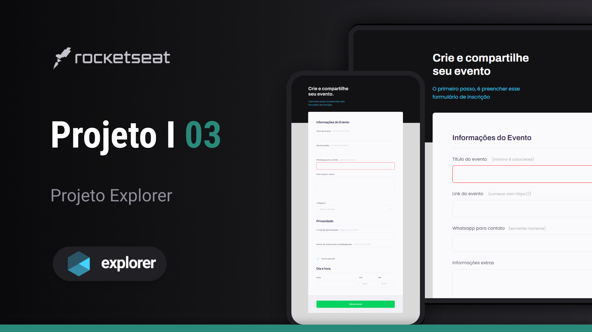

<h1 align="center"> 👨🏼‍💻Projeto 03 I Explorer 
  🚀👨🏼‍🚀#Desafios Rocketseat </h1>
 

⚠️ <strong>ATENÇÃO</strong> ⚠️
 
Este é um projeto conceitual e não representa uma empresa ou serviço real.   Ele foi criado com o propósito de ser adicionado ao meu portfólio, demonstrando minhas habilidades e capacidades em projetos de design e desenvolvimento.  
<a href="https://rocketforms.typeform.com/to/fPcSmBp9#referral_id=e8eb53b2-1777-4867-9b33-d468fc9d1422o">Estude projetos como este em formato de vídeo clicando aqui!</a>

  <a href="#-tecnologias"> Tecnologias</a>&nbsp;&nbsp;&nbsp;|&nbsp;&nbsp;&nbsp;
  <a href="#-projeto">Projeto</a>&nbsp;&nbsp;&nbsp;|&nbsp;&nbsp;&nbsp;
  <a href="#-layout">Layout</a>&nbsp;&nbsp;&nbsp;|&nbsp;&nbsp;&nbsp;
  <a href="#memo-licença">Licença</a>

  

 

  

## 🚀 Tecnologias

Esse projeto foi desenvolvido com as seguintes tecnologias:

- HTML e CSS
- Git e Github
- Figma

## 💻 Projeto

O Projeto 03 é um formulário para uma empresa cujo serviço prestado é a criação de eventos, com o intuito coletar informações e dados para aprestação do serviço...já que a mesma oferece exclusividade,montando os eventos de acordo com as preferências e exigências dos clientes. 
 Este projeto é dividido em 3 etapas de preenchimento:

- <strong>Informações do Evento</strong>  
Contém 5 campos de preenchmento (sendo 2 de tipo texto ,1 do tipo número,1 do tipo link e 1 do tipo seletor )

- <strong>Privacidade</strong>  
Contém 3 campos de preenchmento (sendo 1 de tipo texto ,1 do tipo password,1 do tipo checkbox )

- <strong>Dia e hora</strong>  
Contém 3 campos de preenchmento (sendo 1 de tipo data ,1 do tipo hora inicial,
1 do tipo hora de término)

## 🔖 Layout

Você pode visualizar o layout do projeto através [DESSE LINK](https://www.figma.com/file/riCDgxK0eWbpZRVJd8f2cr/Explorer-Stage-03-Projeto-01-Copy?fuid=1263967232935563704).   <strong>OBS:
</strong> É necessário ter conta no [Figma](https://figma.com) para acessá-lo.

## 📝 Licença

Esse projeto está sob a licença MIT.

---

😉 Feito com 💜 by Pablo Perdigão, aluno Explorer da Rocketseat!  
📲 [Participe da comunidade Rocketseat!](https://discord.gg/rocketseat)
